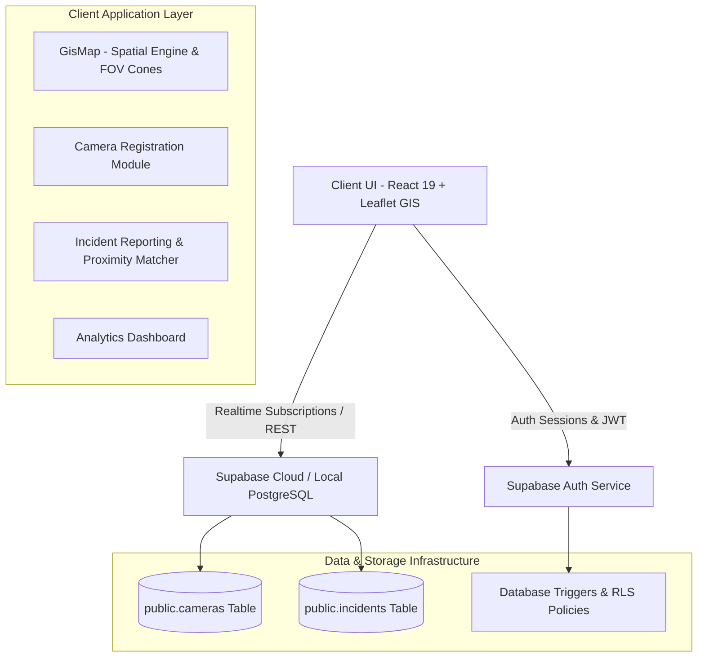

# 🛡️ GuardianGIS — CCTV Registration & Geospatial Surveillance Intelligence Platform

[](https://react.dev/)
[](https://www.typescriptlang.org/)
[](https://vitejs.dev/)
[](https://supabase.com/)
[](https://leafletjs.com/)

**GuardianGIS** is an enterprise-grade, real-time CCTV Registration and Geospatial Surveillance Management Platform designed for municipal authorities, law enforcement agencies, and private security operators. It unifies distributed closed-circuit television (CCTV) metadata, spatial visual field-of-view (FOV) rendering, incident reporting, proximity camera matching, and real-time operational analytics into a cohesive web interface.

---

## 📑 Table of Contents

- [Architectural Overview](#-architectural-overview)
- [Key Capabilities & Features](#-key-capabilities--features)
- [System Architecture](#-system-architecture)
- [Database Schema & Security (Supabase RLS)](#-database-schema--security-supabase-rls)
- [Geospatial & Mathematical Engine](#-geospatial--mathematical-engine)
- [Role-Based Access Control (RBAC)](#-role-based-access-control-rbac)
- [Tech Stack](#-tech-stack)
- [Getting Started](#-getting-started)
  - [Prerequisites](#prerequisites)
  - [Installation](#installation)
  - [Environment Configuration](#environment-configuration)
  - [Database Initialization](#database-initialization)
  - [Running the Application](#running-the-application)
- [Project Directory Structure](#-project-directory-structure)
- [Available Scripts](#-available-scripts)
- [License](#-license)

---

## 🏛️ Architectural Overview

GuardianGIS bridges the gap between public law enforcement surveillance infrastructure and privately owned security cameras. By aggregating camera telemetry (GPS coordinates, lens type, azimuth angle, field of view cone, RTSP stream URLs, retention policies), the system provides first responders with situational awareness during critical incidents.



---

## ✨ Key Capabilities & Features

### 1. 🗺️ Interactive GIS Map Engine
* **Multi-Layer Base Maps**: Toggle between **Dark Vector Canvas**, **OpenStreetMap Standard**, **High-Resolution Satellite Imagery**, and **Spatial Heatmap Overlay**.
* **Dynamic FOV Cones**: Renders exact optical coverage field-of-view (FOV) wedges based on azimuth facing direction (0°–360°), horizontal coverage angle, and maximum effective range in meters.
* **Geofencing Radius Tool**: Measure spatial clearance and count active surveillance cameras within user-defined radial distance thresholds (e.g., 500m, 1km, 2km).
* **Interactive Marker Clustering**: Differentiates public municipal cameras from private commercial/residential feeds with distinctive status badges (Active, Maintenance, Offline).

### 2. 📹 Comprehensive Camera Telemetry Registration
* Multi-field registration form covering:
  * **General Data**: Camera ID, custom display name, ownership classification (`public` vs `private`).
  * **Optical Specifications**: Camera type (`ptz`, `dome`, `bullet`, `thermal`, `panoramic`), resolution (`1080p`, `2k`, `4k`, `720p`), night vision capability, PTZ motorized control.
  * **Geospatial & Vector Data**: Precise Latitude/Longitude coordinates, district name, address, azimuth angle, FOV distance/angle.
  * **Network & Storage**: RTSP/IP stream URL, storage retention period (days), maintenance timestamps.
  * **Ownership & Compliance**: Owner contact info, department badge ID, explicit law enforcement consent declaration.

### 3. 🚨 Incident Management & Spatial Proximity Matcher
* **Incident Lifecycle**: File security incidents (`burglary`, `vandalism`, `traffic_accident`, `suspicious_activity`, `assault`, `missing_person`).
* **Automated Proximity Query**: Uses spatial radial math to automatically search and associate active cameras within range of reported incident coordinates.
* **Status Workflow**: Track incident progress through `submitted` ➡️ `under_investigation` ➡️ `footage_requested` ➡️ `resolved`.

### 4. 📊 Command Analytics Dashboard
* **Surveillance Metrics**: Total camera count, active coverage percentage, public/private ratio, total incidents investigated.
* **District Density Distribution**: Breakdown of camera deployments across metropolitan zones.
* **Operational Health Status**: Real-time ratio of operational vs. offline/maintenance units.

---

## 🗄️ Database Schema & Security (Supabase RLS)

GuardianGIS relies on a PostgreSQL database powered by Supabase with Row Level Security (RLS) enabled on all tables.

### 1. `public.cameras`
| Column | Type | Constraints | Description |
| :--- | :--- | :--- | :--- |
| `id` | `TEXT` | `PRIMARY KEY` | Unique camera identifier (e.g., `CAM-PUB-001`) |
| `name` | `TEXT` | `NOT NULL` | Camera description / location label |
| `ownership` | `TEXT` | `CHECK (public, private)` | Ownership category |
| `status` | `TEXT` | `CHECK (active, maintenance, offline)` | Operational state |
| `type` | `TEXT` | `CHECK (ptz, dome, bullet, thermal, panoramic)` | Camera physical form factor |
| `resolution` | `TEXT` | `CHECK (1080p, 4k, 2k, 720p)` | Video feed resolution |
| `lat` / `lng` | `DOUBLE PRECISION` | `NOT NULL` | WGS84 latitude & longitude coordinates |
| `azimuth` | `INT` | `DEFAULT 0` | Compass facing angle (0° = North, 90° = East) |
| `fov_angle` | `INT` | `DEFAULT 90` | Horizontal field of view arc (degrees) |
| `fov_distance` | `INT` | `DEFAULT 80` | Lens range distance (meters) |
| `consent_law_enforcement` | `BOOLEAN` | `DEFAULT true` | Permission flag for police footage access |

### 2. `public.incidents`
| Column | Type | Constraints | Description |
| :--- | :--- | :--- | :--- |
| `id` | `TEXT` | `PRIMARY KEY` | Incident report code (e.g., `INC-2026-8801`) |
| `title` | `TEXT` | `NOT NULL` | Brief incident heading |
| `type` | `TEXT` | `NOT NULL` | Category of event |
| `severity` | `TEXT` | `CHECK (critical, high, medium, low)` | Severity ranking |
| `status` | `TEXT` | `CHECK (submitted, under_investigation, footage_requested, resolved)` | Lifecycle state |
| `nearby_camera_ids` | `TEXT[]` | `DEFAULT '{}'` | Array of spatially matched camera IDs |

### 3. Database Functions & Triggers
* **Auto Email Confirmation**: Triggers automated instant verification on account insertion to streamline deployment without mandatory mail server latency.

---

## 🧮 Geospatial & Mathematical Engine

### Field-of-View (FOV) Polygon Calculation
To render accurate visual wedges on the Leaflet map canvas, GuardianGIS computes spatial polygon vertices from azimuth angle $\theta$, field angle $\Delta\theta$, range $d$, and origin coordinate $(Lat_0, Lng_0)$:

$$\theta_1 = \theta - \frac{\Delta\theta}{2}, \quad \theta_2 = \theta + \frac{\Delta\theta}{2}$$

Coordinates of boundary points are projected using geodesic approximation:

$$\Delta Lat = \frac{d \cdot \cos(\theta)}{111320}$$

$$\Delta Lng = \frac{d \cdot \sin(\theta)}{111320 \cdot \cos(Lat_0 \cdot \frac{\pi}{180})}$$

---

## 🔐 Role-Based Access Control (RBAC)

The system implements strict application-level and database-level role matrix:

| Action / View | Public User | Private Owner | Law Enforcement / Admin |
| :--- | :---: | :---: | :---: |
| View GIS Map & Public Feeds | ✅ | ✅ | ✅ |
| View Private Camera Metadata | ❌ (Masked) | ✅ (Owned) | ✅ (If Consented) |
| Register New Camera | ❌ | ✅ | ✅ |
| Submit Incident Report | ✅ | ✅ | ✅ |
| Access Analytics Dashboard | ❌ | ❌ | ✅ |
| Request Official Footage | ❌ | ❌ | ✅ |

---

## 🛠️ Tech Stack

* **Frontend Framework**: [React 19](https://react.dev/) + [Vite 8](https://vitejs.dev/)
* **Language**: [TypeScript 6.0](https://www.typescriptlang.org/)
* **Mapping Engine**: [Leaflet 1.9](https://leafletjs.com/) + [React-Leaflet 5.0](https://react-leaflet.js.org/)
* **Backend Database & Realtime**: [Supabase](https://supabase.com/) (PostgreSQL + Realtime Pub/Sub)
* **Iconography**: [Lucide React](https://lucide.dev/)
* **Code Quality & Linting**: [Oxlint](https://oxc.rs/)

---

## 🚀 Getting Started

### Prerequisites
* **Node.js**: `v18.0.0` or higher
* **npm**: `v9.0.0` or higher
* **Supabase Project** (Cloud or Local CLI instance)

### Installation

1. **Clone Repository**:
   ```bash
   git clone https://github.com/mikii-john/cctv-registration.git
   cd cctv-registration
   ```

2. **Install Dependencies**:
   ```bash
   npm install
   ```

### Environment Configuration

Create a `.env` file in the root directory:

```env
VITE_SUPABASE_URL=https://your-supabase-project-id.supabase.co
VITE_SUPABASE_ANON_KEY=your-supabase-anon-key
```

> *Note*: If environment variables are omitted or invalid, GuardianGIS will automatically fallback to an in-memory resilient mock database mode for local evaluation.

### Database Initialization

1. Open your Supabase SQL Editor dashboard.
2. Paste and run the contents of [`supabase/schema.sql`](file:///c:/Users/Milkesa/Desktop/gutu/supabase/schema.sql).
3. This creates the `cameras` and `incidents` tables, configures spatial indexes, sets up RLS policies, seeds sample municipal cameras, and configures auto-confirm email triggers.

### Running the Application

* **Development Server**:
  ```bash
  npm run dev
  ```
  Open `http://localhost:5173` in your browser.

* **Production Build**:
  ```bash
  npm run build
  ```

* **Preview Production Build**:
  ```bash
  npm run preview
  ```

* **Linting & Code Quality**:
  ```bash
  npm run lint
  ```

---

## 📁 Project Directory Structure

```
gutu/
├── public/                 # Static assets & markers
├── src/
│   ├── components/         # Core React Components
│   │   ├── AnalyticsDashboard.tsx    # Operational metrics & district analysis
│   │   ├── AuthModal.tsx             # Supabase Authentication modal
│   │   ├── CameraDetailsModal.tsx    # Technical detail view & telemetry editor
│   │   ├── CameraRegistrationForm.tsx # Multi-step camera registration flow
│   │   ├── GisMap.tsx                # Leaflet mapping & FOV renderer
│   │   ├── IncidentList.tsx          # Incident dashboard & proximity matcher
│   │   ├── IncidentReportingForm.tsx # Incident submission workflow
│   │   └── Navbar.tsx                # Header navigation & RBAC controls
│   ├── context/
│   │   └── CctvContext.tsx           # Global state management & hooks
│   ├── lib/
│   │   └── supabase.ts               # Supabase client initializer
│   ├── services/
│   │   ├── authService.ts            # Authentication & session methods
│   │   └── cctvService.ts            # Database queries & realtime subscriptions
│   ├── types/
│   │   └── cctv.ts                   # TypeScript interfaces & domain types
│   ├── App.tsx                       # Root application view router
│   ├── main.tsx                      # DOM entry point
│   └── index.css                     # Global design system & theme tokens
├── supabase/
│   └── schema.sql                    # Full PostgreSQL DDL, RLS & seed script
├── .env.example                      # Template environment configuration
├── package.json                      # Project dependencies & build scripts
├── tsconfig.json                     # TypeScript compiler configuration
└── vite.config.ts                    # Vite build tool configuration
```

---

## 📄 License

Distributed under the MIT License. See `LICENSE` for details.
